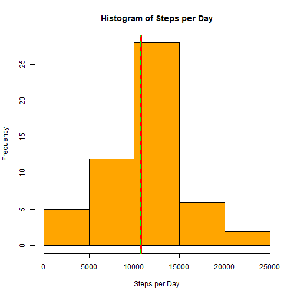
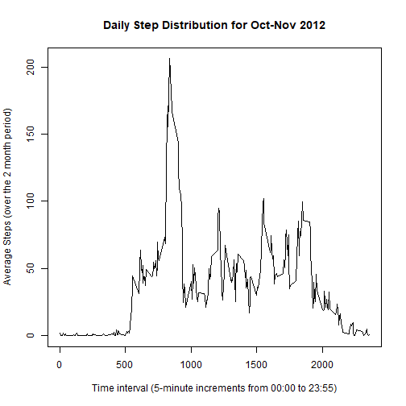
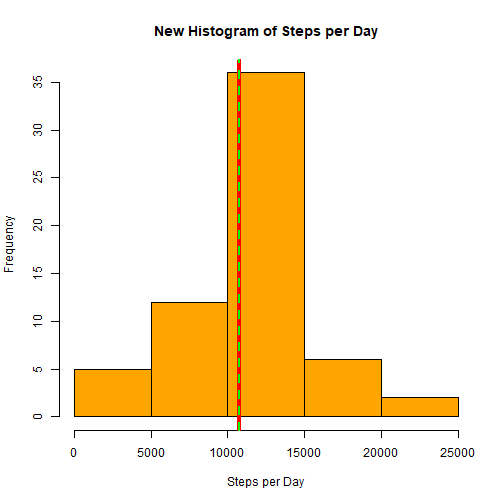
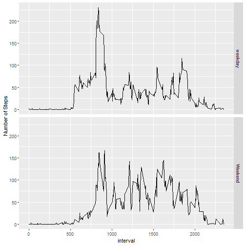

# Steps Taken Analysis  
Michael Frazure

## Introduction

This analysis makes use of the data from a single individual's personal activity monitoring device.  The device collects data at 5-minute intervals throughout the day.  The data used in this analysis was colleected during October and November of 2012, and includes the number of steps taken during each 5-minute interval each day.  For purpose of this analysis I will explore the data, identify any issues such as missing data, and answer the following questions:  

1. What are the mean and median of steps taken each day?  
2. Which 5-minute interval, on average, contains the maximum number of steps?  
3. If there is missing data, determine a means of inputting values for the missing data.  
4. How do steps taken on weekdays compare to steps taken on weekend days?  

## Exploring The Data  
The data is in a zipped file and will be read into a table sampleSteps.  The variable names and dimensions are as follows:  


```r
# read data
sampleSteps <- read.table(unz("activity.zip", "activity.csv"), header = TRUE, sep = ",")
#  get column names
names(sampleSteps)
```

```
## [1] "steps"    "date"     "interval"
```

```r
# get dimensions
dim(sampleSteps)
```

```
## [1] 17568     3
```

```r
# identify how the 5-mainute intervals are organized
range(sampleSteps$interval)
```

```
## [1]    0 2355
```

```r
# look at the steps data
summary(sampleSteps$steps)
```

```
##    Min. 1st Qu.  Median    Mean 3rd Qu.    Max.    NA's 
##    0.00    0.00    0.00   37.38   12.00  806.00    2304
```

```r
# calculate the % of NA values
sum(is.na(sampleSteps$steps))/nrow(sampleSteps)
```

```
## [1] 0.1311475
```
The intervals are measured on a 24 hour clock format ranging from 0 to 2355.  There are 2304 missing values which is 13.1% of the measured periods.

### Histogram of steps taken each day; Mean and Median ignoring missing values  

```r
library(dplyr)
byday <- sampleSteps %>%
        group_by(date) %>%
        summarize(daysteps = sum(steps), na.rm = TRUE)
hist(byday$daysteps, col = "orange", xlab = "Steps per Day", main = "Histogram of Steps per Day")
abline(v = median(byday$daysteps, na.rm = TRUE), col = "red", lwd = 4)
abline(v = mean(byday$daysteps, na.rm = TRUE), col = "green", lwd = 2, lty = 2)
```



In the above histogram, the red line shows the median number of steps per day, and the green dotted line shows the average (mean) steps per day.  They are so close as to be indistinguishable.  The actual numeric values are as follows:


```r
print(paste("Median is ",median(byday$daysteps, na.rm = TRUE)))
```

```
## [1] "Median is  10765"
```

```r
print(paste("Mean is ",mean(byday$daysteps, na.rm = TRUE)))
```

```
## [1] "Mean is  10766.1886792453"
```

### Line plot of steps taken during each 5-minute interval; Interval with maximum total steps.


```r
byinterval <- sampleSteps %>%
        group_by(interval) %>%
        summarize(intervalsteps = mean(steps, na.rm = TRUE), na.rm = TRUE)

plot(byinterval$interval, byinterval$intervalsteps, type = "l", xlab = "Time interval (5-minute increments from 00:00 to 23:55)", ylab = "Average Steps (over the 2 month period)", main = "Daily Step Distribution for Oct-Nov 2012")
```



```r
maxinterval <- filter(byinterval, intervalsteps == max(intervalsteps))
print(paste("The interval with the maximum average steps for the period is ", maxinterval[1,1]))
```

```
## [1] "The interval with the maximum average steps for the period is  835"
```

Therefore the most steps were generally taken during the 8:35 to 8:39 am time period during October through November 2012.

### What to do with missing values?  

In the Introduction above I noted that 13% of the time intervals are missing data.  Here is the information again;


```r
print(paste("There are ", sum(is.na(sampleSteps$steps)), "missing values, representing", sum(is.na(sampleSteps$steps))/nrow(sampleSteps)*100, "percent"))
```

```
## [1] "There are  2304 missing values, representing 13.1147540983607 percent"
```

Given the times of day are most likely somewhat consistent in the number of steps, I will create a new dataset newSample that substitutes the average steps for the interval with the mean number of steps for that interval across the 2 month period.


```r
newSample <- sampleSteps
newSample$steps[which(is.na(newSample))] <- byinterval$intervalsteps[match(byinterval$interval, newSample$interval)]
head(newSample)
```

```
##       steps       date interval
## 1 1.7169811 2012-10-01        0
## 2 0.3396226 2012-10-01        5
## 3 0.1320755 2012-10-01       10
## 4 0.1509434 2012-10-01       15
## 5 0.0754717 2012-10-01       20
## 6 2.0943396 2012-10-01       25
```

Okay let's look at the histogram for the new dataset newSample, along with its mean and median.


```r
newbyday <- newSample %>%
        group_by(date) %>%
        summarize(newdaysteps = sum(steps), na.rm = TRUE)
hist(newbyday$newdaysteps, col = "orange", xlab = "Steps per Day", main = "New Histogram of Steps per Day")
abline(v = median(newbyday$newdaysteps, na.rm = TRUE), col = "red", lwd = 4)
abline(v = mean(newbyday$newdaysteps, na.rm = TRUE), col = "green", lwd = 2, lty = 2)
```




```r
print(paste("Median is ",median(newbyday$newdaysteps, na.rm = TRUE)))
```

```
## [1] "Median is  10766.1886792453"
```

```r
print(paste("Mean is ",mean(newbyday$newdaysteps, na.rm = TRUE)))
```

```
## [1] "Mean is  10766.1886792453"
```


```r
print(paste("The original dataset had a median of ", median(byday$daysteps, na.rm = TRUE), "versus the new dataset having a median of ",  median(newbyday$newdaysteps, na.rm = TRUE)))
```

```
## [1] "The original dataset had a median of  10765 versus the new dataset having a median of  10766.1886792453"
```

```r
print(paste("The original dataset had a mean of ",mean(byday$daysteps, na.rm = TRUE), "versus the new dataset having a median of ",  mean(newbyday$newdaysteps, na.rm = TRUE)))
```

```
## [1] "The original dataset had a mean of  10766.1886792453 versus the new dataset having a median of  10766.1886792453"
```

### Weekdays versus Weekend days  

Out of curiosity, let's look at the difference in steps on weekdays versus weekend days.


```r
# Create function to segregate days into weekday and weekend days.
days_weekday <- c("Monday", "Tuesday","Wednesday","Thursday","Friday")
days_weekend <- c("Saturday","Sunday")
Calculate.weekday <- function(x) {
     if (x %in% days_weekend) {
         return("Weekend")
     } else if (x %in% days_weekday) {
         return("weekday")
     }
     return(NA)
}
```

Here is the new table with the days of the week and the day type as new variables.

```r
typeSample <- mutate(newSample, day = weekdays(as.Date(date)))
typeSample$daytype <- apply(typeSample, 1, function(x) Calculate.weekday(x['day']))

head(typeSample)
```

```
##       steps       date interval    day daytype
## 1 1.7169811 2012-10-01        0 Monday weekday
## 2 0.3396226 2012-10-01        5 Monday weekday
## 3 0.1320755 2012-10-01       10 Monday weekday
## 4 0.1509434 2012-10-01       15 Monday weekday
## 5 0.0754717 2012-10-01       20 Monday weekday
## 6 2.0943396 2012-10-01       25 Monday weekday
```

Now we can plot the average steps taken in each interval for weekdays versus weekend days.


```r
library(ggplot2)
intervaltype <- typeSample %>%
        group_by(daytype,interval) %>%
        summarize(testmean = mean(steps))

q <- qplot(interval, testmean, data = intervaltype, facets = daytype ~ ., geom = "line")
q <- q + ylab("Number of Steps")
q
```



From the plot, it appears that the pattern of steps does adjust on weekends.

This concludes the assignment.
